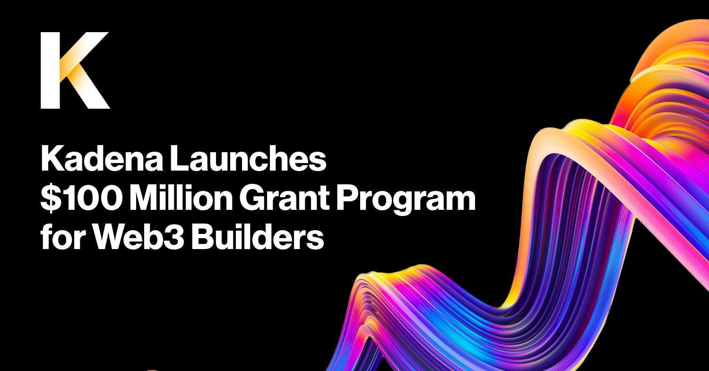

# Kadena Eco Grants: What You Need To Know
#### _Create something new – for yourself and the world_

  

***

- [Purpose](#purpose)
- [How it works](#how-it-works)
- [FAQ](#faq)

## PURPOSE

On April 21st 2022, Kadena Eco has launched a $100 million Grant Program to inspire builders to come and innovate on the Kadena network.

Kadena Eco exists to empower builders to create new projects that transform the world. To realize this mission, we’re doubling down on our growing community by deploying our treasury resources towards the long-term sustainability of our ecosystem. 

Kadena Eco grants will be applied to projects big and small, enabling builders of all backgrounds to succeed on Kadena. With our network of technology experts and strategic partners, we’re here to support builders every step of the way.  

## HOW IT WORKS

The application process is [open](https://khnrs3ltkjv.typeform.com/grant-app?typeform-source=www.google.com)!  All high-quality, open-source projects for gaming, metaverse, NFT, Web3, DeFi and DAO are welcome.   

We will judge grant applications based on the following: 

1. Technical strength
2. Detail of specifications
3. Team experience
4. Practicality

Applicants must be willing to adopt Kadena’s “build in the open” philosophy by contributing content, tutorials and product explainers in relevant channels and communities such as Discord, Medium, Stackoverflow and others. In turn, Kadena Eco will commit to engineering mentorship, office hours and community leadership in addition to monetary support. 

Beyond grant money, you’ll also get support from the Kadena team to get you off the ground and building for success.  

## FAQ

### How can I apply for a grant?

Just fill out the requested information [here](https://khnrs3ltkjv.typeform.com/grant-app?typeform-source=kadena.io), and we’ll notify you via email regarding the status of your application. The more specific and clear you are in your application, the better our team will be able to understand your project proposal.

### What does the application process look like?

The Kadena Eco Grant application process is divided in 4 categories: Project Overview, Team, Development Roadmap and Additional Information.

- If you wish to download the questions and review offline; you may download the entire form [here](https://kadena.io/wp-content/uploads/2022/04/Kadena-Grant-Application.pdf).
- [Apply for a Kadena Eco Grant here](https://khnrs3ltkjv.typeform.com/grant-app)

### What criteria will my submission be evaluated on?

Grant applications are evaluated on technical strength, detail of specifications, team experience, and usefulness to the Kadena ecosystem. All high-quality, open-source projects for gaming, metaverse, NFT, Web3, DeFi and DAO are welcome.

### How much money can my project be granted?

Each proposal will be eligible to receive between $5,000 and $50,000 in KDA tokens.

### Will my project also receive non monetary incentives?

Yes, in addition to monetary support, Kadena Eco will commit to engineering mentorship, office hours, community leadership, potential co-marketing opportunities, and joining Kadena’s [official ecosystem projects](https://kadena.io/ecosystem).

### Who can apply for a grant?

Everyone as long as they’re in a jurisdiction that can receive tokens, and pass KYC.

### What is expected from the Kadena Eco Grantees?

- Applications are evaluated on technical strength, detail of specifications, team experience, and usefulness to the Kadena ecosystem.
- Applicants must be willing to adopt Kadena’s “build in the open” philosophy by contributing content, tutorials and product explainers in relevant channels and communities such as Discord, Medium, Stackoverflow and others.

### When will I hear back about my application?

- The Grants Review Committee will review applications and follow up if more information is needed to make a decision.
- Within 4 weeks of receiving an application, Kadena will notify application team leads of whether their project has been accepted for grant funding.

## KEY RESOURCES

Explore these resources for additional information and support:
- [Apply for a Kadena Eco Grant](https://khnrs3ltkjv.typeform.com/grant-app)
- [Grant Application Form](https://kadena.io/wp-content/uploads/2022/04/Kadena-Grant-Application.pdf)
- <a href="https://www.kadena.io/" target="_blank">Website</a>
- <a href="https://kadena-io.github.io/kadena-docs/" target="_blank">Kadena Docs (resource library)</a>
- <a href="https://discord.io/kadena" target="_blank">Discord</a>
- <a href="https://twitter.com/kadena_io" target="_blank">Twitter</a>
